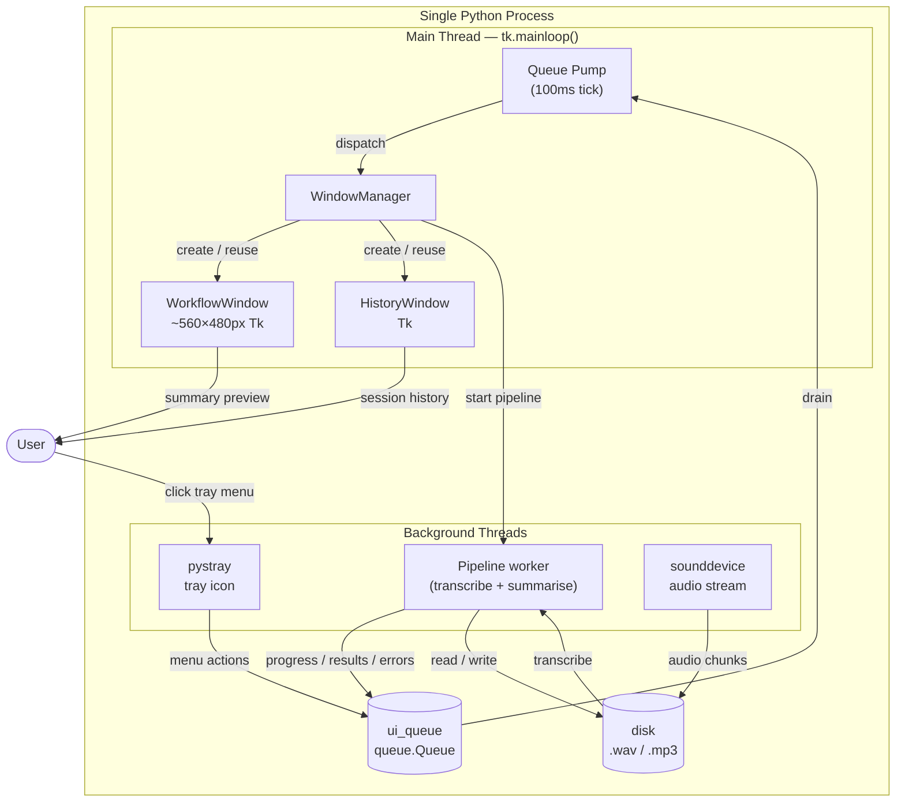

# SummarizeAudio — Architecture

> One-liner: A macOS-first (Windows-compatible) menu bar app that records conversations or transcribes audio files, then summarises the result using a local AI model. No data leaves the machine.

---

## Technology Stack

| Package / Tool | What it is |
|---|---|
| `Python 3.11+` | Primary language |
| `pystray` | Cross-platform system tray icon library — renders the menu bar icon and menu. On macOS it runs in a background thread, leaving the main thread free for Tk. |
| `rumps` | macOS-only menu bar framework (wraps `NSApp` / `NSMenu`). **Currently used on macOS; being replaced by `pystray` — see ADR-003.** Runs on the main thread, which prevents Tk from running in the same process. |
| `tkinter` (stdlib) | Python's built-in GUI toolkit. Draws all pop-up windows: workflow progress, history, file pickers, prompt editor. Must run on the main thread. |
| `rumps` vs `pystray` vs `tkinter` | See the [Library Roles](#library-roles-tk-pystray-rumps) section below for a plain-English explanation. |
| `sounddevice` | Cross-platform audio capture (wraps PortAudio). Used for mic + system loopback recording. |
| `numpy` | Audio chunk handling inside `sounddevice` callbacks. |
| `wave` (stdlib) | Incremental WAV file writing during recording; flushes to disk every 30 seconds. |
| `pydub` | Converts the recorded `.wav` to `.mp3` after recording stops. |
| `ffmpeg` | System dependency (not a pip package). Required by `pydub` for MP3 encoding and by `faster-whisper` for audio format decoding. Users install once via Homebrew or `winget`. |
| `faster-whisper` | Local on-device speech-to-text transcription via CTranslate2. No API, no internet. |
| `requests` | HTTP client for calling the local Ollama API. |
| `tomllib` / `tomli` | Reads `~/.summarizeaudio/config.toml`. `tomllib` is stdlib in Python 3.11+; `tomli` is the backport for older versions. |
| `Pillow` | Loads tray icon image files (`.png` / `.ico`) for `pystray`. |
| `plyer` | Cross-platform desktop notifications. Used as a fallback on Windows; macOS uses `osascript` first. |
| `osascript` | macOS AppleScript runner (`subprocess`). Used for native notifications and for the native file picker dialog. |
| `BlackHole` | macOS virtual audio device (user-installed, not a pip package). Enables system audio loopback capture so calls and meetings can be recorded alongside the microphone. |
| `pyproject.toml` | Project packaging, dependency declaration, and entry point (`python -m summarizeaudio`). |

---

## Library Roles: Tk, pystray, rumps

These three libraries each handle a different part of the UI and have important interactions:

**Tkinter (tk)** draws the actual windows — the progress bar, buttons, text fields, step list, and summary preview that appear when a workflow runs. It is bundled with Python, so no extra install is needed. On macOS, Tk must run on the **main thread** of the process; calling it from a background thread causes crashes.

**rumps** is a macOS-only library for putting an icon in the menu bar (the strip in the top-right corner of the screen where Wi-Fi and the clock live). It wraps Apple's native `NSApp` and runs its own event loop on the **main thread**. The benefit: it sets `NSApplicationActivationPolicy` to `Accessory` at startup, which tells macOS "this is a menu bar app, not a regular app" — so no dock icon ever appears. The problem: because `rumps` owns the main thread, there is no room for Tk. This is why the current implementation spawns a separate Python subprocess for every window, and those subprocesses produce Python dock icons.

**pystray** also puts an icon in the menu bar / system tray and works cross-platform (macOS, Windows, Linux). The key difference from `rumps`: on macOS it runs the tray icon in a **background thread**, leaving the main thread free. This means Tk can run in the same process without any subprocess gymnastics. Replacing `rumps` with `pystray` on macOS — combined with calling `NSApp.setActivationPolicy(.accessory)` once at startup — is the mechanism that eliminates dock icons entirely while keeping windows in a single process.

---

## Component Breakdown

| Component | File | Responsibility |
|---|---|---|
| Entry point | `__main__.py` | Sets up logging, applies macOS activation policy (no dock icon), starts `TrayApp`. |
| Tray app | `tray.py` | Owns the `pystray` icon lifecycle, menu state, icon state, single-instance lockfile, and `ui_queue` drain loop. Posts window commands to `WindowManager` via the queue. |
| Window manager | `window_manager.py` | **Runs on the main thread.** Owns all Tk windows. Creates `WorkflowWindow` and `HistoryWindow` on demand; reuses or closes existing windows when the tray requests a new action. |
| Workflow window | `workflow_window.py` | Tk window (~560×480px) that drives the full workflow: file chooser → progress + progress bar → prompt editor → name input → summary preview. Retargetable — can be switched to a new mode without closing. |
| History window | `history_window.py` | Tk window showing past sessions (transcript, audio, summary links). Reused on successive "History" menu clicks. |
| UI dispatcher | `ui_dispatcher.py` | Thread-safe `queue.Queue` (`ui_queue`) + drain function. The single channel through which all background threads communicate with the main thread. |
| Pipeline | `pipeline.py` | Background thread entry point for all three modes (record / local audio / local text). Posts progress events, phase changes, errors, and results to `ui_queue`. |
| Recorder | `recorder.py` | Platform-aware audio capture. Writes audio incrementally to a temp `.wav`, flushes every 30 s. Converts to `.mp3` on stop. |
| Transcriber | `transcriber.py` | Loads `faster-whisper`, transcribes the audio file, posts segment-level progress to `ui_queue`. Outputs `.txt`. |
| Summarizer | `summarizer.py` | Builds prompt from config + optional override, calls Ollama local API, saves `.md` summary. |
| Renamer | `renamer.py` | Moves/copies output files into `AudioFiles/`, `TranscriptionFiles/`, `SummaryFiles/` using the session name + date. Resolves filename collisions. |
| Notifier | `notifier.py` | Sends a system notification on completion. macOS: `osascript`; Windows: `plyer`. |
| Config | `config.py` | Loads and validates `~/.summarizeaudio/config.toml`. Generates defaults on first run. Single source of truth for the default summarization prompt and model selection logic. |
| Sessions | `sessions.py` | Discovers and represents past session files on disk. |
| Error handler | `error_handler.py` | Formats error messages. Posts errors to `ui_queue` for display in the workflow window. |

---

## Threading Model

```
Main thread — tk.mainloop()
  │
  ├── Queue pump (100ms Tk `after` tick)
  │     └── drains ui_queue → dispatches to WindowManager
  │           ├── show / update WorkflowWindow
  │           ├── show / update HistoryWindow
  │           └── icon state updates → posted back to pystray thread
  │
  └── WindowManager
        ├── WorkflowWindow (Tk widgets, lives here)
        └── HistoryWindow  (Tk widgets, lives here)

pystray thread (background)
  └── renders tray icon + menu
  └── menu callbacks → post commands to ui_queue

Pipeline worker thread (one at a time, guarded)
  └── transcriber → renamer → summarizer → notifier
  └── posts to ui_queue: transcription_progress, workflow_phase,
       override_dialog, name_dialog, summary_ready, error

sounddevice stream thread (managed by PortAudio internally)
  └── audio callback writes chunks → .wav file on disk
```

**Thread-safety rules:**
- Tk is **never** called from any background thread. All window updates go through `ui_queue`.
- `ui_queue` is a `queue.Queue` — thread-safe FIFO.
- Pipeline uses `threading.Event` for blocking interactions (prompt override, name input): posts the event to `ui_queue`, then blocks until the main thread resolves it. Timeout: 300 s for prompt override, 30 s for name input.
- Only one pipeline runs at a time, enforced by a `threading.Event` guard in `tray.py`.

---

## Data Flow

```
[Tray menu action]
  │
  ▼
ui_queue  ──────────────────────────────────────────────────────────────────┐
  │                                                                          │
  ▼ (main thread drain)                                                      │
WindowManager                                                                │
  │                                                                          │
  ├── show WorkflowWindow(mode)  ←── reuse existing window if idle          │
  │     │                                                                    │
  │     ├── [mode: record]   mp3_path → pipeline thread                     │
  │     ├── [mode: audio]    user picks file → pipeline thread              │
  │     └── [mode: text]     user picks file → pipeline thread              │
  │                │                                                         │
  │                ▼                                                         │
  │          Pipeline thread                                                 │
  │            ├── Transcriber  → posts transcription_progress ────────────>│
  │            ├── Summarizer   → posts workflow_phase("summarizing") ─────>│
  │            │                → posts override_dialog (if configured) ───>│
  │            ├── Renamer      → moves files                               │
  │            └── Notifier     → posts summary_ready ──────────────────────┘
  │
  └── show HistoryWindow  ←── reuse if already open
```

---

## Window Reuse Logic

When the tray posts a `show_workflow` command while a `WorkflowWindow` is already open:

| Current window state | Action |
|---|---|
| Showing chooser (idle, no pipeline running) | Retarget to new mode in place. Bring to focus. |
| Pipeline actively running | Close current window, open new one for new action. |
| Showing summary / done state | Close current window, open new one. |

When `show_history` is posted and a `HistoryWindow` is already open: bring to focus, refresh session list.

---

## Mermaid Diagram



---

## macOS Dock Icon Suppression

On macOS, calling:

```python
import AppKit
NSApp = AppKit.NSApplication.sharedApplication()
NSApp.setActivationPolicy_(AppKit.NSApplicationActivationPolicyAccessory)
```

once in `__main__.py` — before any Tk window is created — marks the entire process as a menu bar accessory. macOS does not show accessory apps in the dock or the CMD+Tab switcher. All Tk windows remain fully visible and interactive; they simply do not produce a dock icon.

This replaces the previous approach of spawning per-window subprocesses (which produced 1–2 bare Python dock icons whenever windows were open).

---

## Configuration

Config file: `~/.summarizeaudio/config.toml`. Created with sensible defaults on first run.

```toml
[storage]
output_folder = "~/Applications/SummarizeAudio/AudioSummaries"

[whisper]
model = "base"       # tiny | base | small | medium | large
language = "en"

[ollama]
host = "http://localhost:11434"
model = "gemma3:4b"  # auto-selected based on RAM at install time

[summarization]
default_prompt = """..."""  # full prompt template; see config.py for default

[behavior]
show_override_dialog = true
auto_open_summary = false

[recording]
input_device = ""    # blank = auto-detect; set to exact device name to override
```

---

## File Locations

```
~/Applications/SummarizeAudio/          ← install root (macOS)
  AudioSummaries/
    AudioFiles/           recorded .mp3 files
    TranscriptionFiles/   transcript .txt files
    SummaryFiles/         summary .md files
  venv/                   Python virtual environment

~/.summarizeaudio/
  config.toml             user configuration
  app.log                 debug log
  app.lock                single-instance lockfile (PID)
```
